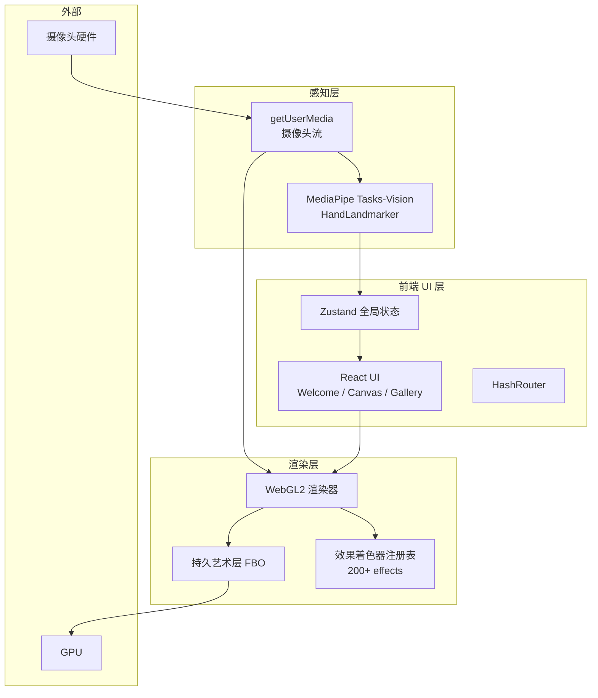
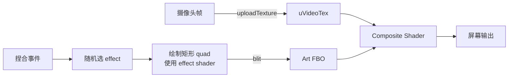

## 1. 架构设计



## 2. 技术说明

- **前端**：React@18 + TypeScript + Vite@5 + Tailwind CSS@3
- **路由**：HashRouter（GitHub Pages 子路径安全，刷新不 404）
- **状态管理**：Zustand
- **动画**：framer-motion
- **图标**：lucide-react
- **手部识别**：`@mediapipe/tasks-vision` 的 `HandLandmarker`（21 点 / 双手 / WASM）
- **渲染**：原生 WebGL2（不依赖 Three.js，减小体积，效果着色器更直接）
- **初始化工具**：`npm create vite@latest ArtCam -- --template react-ts`
- **构建脚本**：`tsc --noEmit && vite build`
- **部署**：GitHub Pages + 自定义域名 + GitHub Actions 自动部署

## 3. 路由定义

| 路由 | 用途 |
|------|------|
| `/` | Welcome 欢迎页 |
| `/canvas` | 主创作页（摄像头 + 手势 + 艺术效果） |
| `/gallery` | 效果图鉴页 |
| `*` | 兜底重定向到 `/` |

## 4. 核心数据结构

```typescript
// 手部识别
interface Landmark { x: number; y: number; z: number; }
interface HandFrame {
  handedness: 'Left' | 'Right';
  landmarks: Landmark[];            // 21 points
  thumbTip: Landmark;               // index 4
  indexTip: Landmark;               // index 8
  pinchMidpoint: { x: number; y: number };
  pinchDistance: number;            // normalized 0..1
  isPinching: boolean;              // distance < 0.05
}

// 艺术效果定义
type EffectCategory =
  | 'noise' | 'fractal' | 'geometric' | 'painterly'
  | 'pixel' | 'wave' | 'color' | 'mosaic';

interface ArtEffect {
  id: number;
  name: string;
  category: EffectCategory;
  glslBody: string;                 // fragment shader function body
  params: Record<string, number>;   // default uniforms
  palette: [number, number, number][]; // 0..1 RGB stops
}

// 已放置矩形
interface PlacedRect {
  id: string;
  x1: number; y1: number; x2: number; y2: number; // canvas px
  effectId: number;
  params: Record<string, number>;
  timestamp: number;
}
```

## 5. 效果生成策略（200+ 效果）

### 5.1 算法基元（~30 个）

Voronoi、Perlin、Simplex、Worley、ValueNoise、Kaleidoscope、Mandala、JuliaSet、Mandelbrot、IFS、Cellular、WaveInterference、PixelSort、Mosaic、ASCII、Posterize、EdgeDetect、FlowField、Truchet、Hexagon、Stripe、GridWeave、Spiral、LensDisplace、CRT、VHS、GlitchRGB、OilPaint、Watercolor、Pointillism、CrossStitch、Stippling、Halftone、Delaunay、ReactionDiffusion

### 5.2 变体组合

每个算法基元 × 不同调色板（8 套）× 不同密度/缩放（3 档）= 多个独立效果。
目标：30 算法 × 7-8 变体 = **210+ 注册效果**，每个有独立 id 与名称。

### 5.3 调色板库

`palettes.ts` 内置 8 套：Sunset、Cyberpunk、MonoInk、Pastel、Neon、Earth、Vaporwave、GoldLeaf。
每套 5 色停点，着色器内通过 `palette(t)` 函数插值。

## 6. WebGL 渲染管线



### 6.1 每帧流程

1. `gl.texImage2D` 上传摄像头帧到 `uVideoTex`
2. 绑定屏幕 FBO，绘制全屏四边形：使用 composite shader（背景=video, 前景=artFBO）
3. Canvas2D 叠加层绘制手部骨架与矩形预览框

### 6.2 捏合触发流程

1. 检测到双手同时捏合（debounce 300ms 防抖）
2. 从注册表随机选择一个 `ArtEffect`
3. 绑定 artFBO，绘制矩形 quad（顶点为对角中点坐标）
4. 启用该 effect 的 fragment shader，注入 `uTime`、`uParams[]`、`uPalette[]`
5. `gl.blitFramebuffer` 或直接渲染到 artFBO
6. 推入 `PlacedRect` 列表，供撤销使用

### 6.3 撤销 / 清空

- **撤销**：弹出 `PlacedRect` 列表最后一项 → 清空 artFBO → 重放剩余所有矩形（一次性批渲染）
- **清空**：`gl.clearColor` 清空 artFBO

## 7. 关键着色器接口

```glsl
// 共用 uniforms
uniform sampler2D uVideoTex;   // 摄像头帧
uniform vec2  uResolution;     // canvas size
uniform float uTime;           // seconds
uniform float uParams[8];      // effect parameters
uniform vec3  uPalette[8];     // palette color stops
uniform int   uEffectId;       // for uber-shader branching (optional)

// 效果函数签名（每个 effect 都实现）
vec4 effect(vec2 uv, sampler2D video, float time, float params[8], vec3 palette[8]) {
  // ... effect-specific GLSL body ...
  return vec4(color, 1.0);
}
```

## 8. GitHub Pages 部署

### 8.1 `vite.config.ts`

- `base: './'`：子路径安全的资源加载
- `build.rollupOptions.output.manualChunks`：拆分 `mediapipe` / `react` / `gl` 三个 chunk
- `server.headers` 添加 `Cross-Origin-Embedder-Policy: require-corp` 以确保 MediaPipe WASM 多线程可用（可选）

### 8.2 `.github/workflows/deploy.yml`

- 触发：`push` 到 `main` 分支
- 步骤：checkout → setup Node 20 → `npm ci` → `npm run build` → `upload-pages-artifact@v3` → `deploy-pages@v4`
- 权限：`pages: write` + `id-token: write`

### 8.3 静态资源

- `public/CNAME`：`artcam.n0th1n3ssd0ma1n.top`
- `public/.nojekyll`：空文件，禁用 Jekyll 处理（保留 `_assets` 风格输出）
- `public/robots.txt`：允许爬取

### 8.4 仓库设置

- Settings → Pages → Source = "GitHub Actions"
- DNS：CNAME `artcam` → `starsailsclover.github.io`

## 9. 性能与兼容性

- MediaPipe WASM 通过 CDN 加载（`https://cdn.jsdelivr.net/npm/@mediapipe/tasks-vision/wasm`）
- 摄像头分辨率：默认 1280×720，移动端降级 640×480
- WebGL2 上下文属性：`antialias: false`（效果自处理 AA）、`preserveDrawingBuffer: true`（保存 PNG）
- 降级：若浏览器不支持 WebGL2 → 提示用户使用现代浏览器
